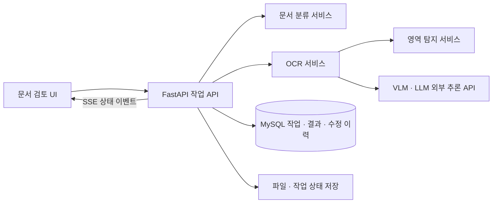

# Document OCR Workbench

PDF·이미지 문서에서 필요한 페이지를 선별하고, 표와 식별 정보를 추출한 뒤 사람이 검토·수정하여 저장하는 OCR 작업 도구입니다. **실제 프로젝트 코드에서 운영 데이터와 접속 정보를 제외한 포트폴리오용 코드 공개본**입니다.

자동 인식 결과를 그대로 확정하는 대신, 페이지 분류·회전 보정·부분 재처리·표 편집·변경 이력을 하나의 작업 흐름으로 연결합니다. 모델 가중치와 운영 DB는 포함하지 않으므로, 내려받기만 해서는 전체 OCR이 실행되지 않습니다.

## 사용 흐름

1. PDF 또는 이미지를 업로드하고 작업을 생성합니다.
2. 문서 분류 모델로 관심 페이지와 방향을 판별하고, 사용자가 분류·회전을 보정합니다.
3. YOLO가 표·제목·화학조성 영역을 탐지합니다.
4. OpenAI 호환 VLM으로 영역을 읽고, 텍스트 모델로 결과를 구조화합니다.
5. SSE로 처리 상태를 확인하며, 필요한 파일이나 페이지만 재처리합니다.
6. 결과 표를 수정하고 DB 및 셀 단위 변경 이력을 저장합니다.



## 코드에서 볼 부분

| 영역 | 경로 | 구현 내용 |
|---|---|---|
| 작업 관리 | `api_service/services/jobs_service.py` | PDF 페이지 처리, 진행률, 취소·재처리, 만료 작업 복구 |
| 페이지 상태 | `api_service/repositories/job_pages_repo.py` | DB 기반 페이지 선점, 시도 횟수, lease 및 페이지별 상태 |
| 상태 복원 | `api_service/services/runtime_persistence.py` | 작업·파일 상태 저장 및 DB 기반 재시작 복원 코드 |
| 인식 흐름 | `core/ocr_processor.py` | 영역별 추론, 결과 파싱·정규화, 다단계 처리 |
| 수정 이력 | `core/ocr_db.py` | 셀 변경 비교, 수정 이력 저장·조회, 결과 테이블 관리 |
| 검토 화면 | `ui/public/src/` | 분류·회전, SSE 결과 갱신, Tabulator 표 편집 |

기술: Python, FastAPI, MySQL/PyMySQL, PyTorch·TorchVision, Ultralytics YOLO, OpenAI 호환 API, JavaScript, Tabulator.

## 외부 서비스 없이 확인하기

Python 3.10 이상에서 저장소 루트 기준으로 실행합니다. 아래 예제와 테스트는 표준 라이브러리만 사용하며 **OCR 정확도 테스트가 아닙니다**.

```bash
python -m examples.review_history
python -m unittest discover -s tests -v
```

예제는 가상의 성분 값 `0.12 → 0.15` 수정을 실제 이력 변환 함수에 넣어, 변경된 셀만 추출하는 동작을 보여줍니다.

## 전체 서비스 구성

실제 문서 처리에는 다음이 별도로 필요합니다.

- MySQL 서버와 전용 DB·계정. 원본 DB 덤프는 제공하지 않습니다.
- 분류 모델: ResNet50, 출력 4개 클래스(`int_ver`, `int_hori`, `no_int_ver`, `no_int_hori`)와 호환되는 가중치.
- 문서 영역 탐지용 YOLO 가중치. 원본 가중치와 학습 데이터는 제공하지 않습니다.
- 이미지 입력과 스트리밍을 지원하는 OpenAI 호환 VLM 및 텍스트 모델 API.

```bash
python -m venv .venv
source .venv/bin/activate
pip install -r requirements.txt
cp .env.example .env
# .env의 DB·모델·추론 API 설정을 자신의 로컬 환경에 맞게 수정
set -a
source .env
set +a
```

의존성 목록은 코드의 import에서 재구성했습니다. 원본 잠금 파일이 아니며, CUDA 환경에서는 호환되는 PyTorch/TorchVision 조합을 별도 확인해야 합니다. 프로그램은 `.env`를 자동 로드하지 않으므로 **각 터미널에서 위 환경 변수 로드가 필요합니다**.

각각 별도 터미널에서 실행합니다.

```bash
python -m yolo_service.server       # 8011
python -m ocr_service.server        # 8012
python -m doc_filter_service.server # 8013
python -m api_service.server        # 8010
python -m http.server 8080 --bind 127.0.0.1 --directory ui/public
```

브라우저에서 `http://127.0.0.1:8080`을 엽니다. **API 서버도 시작 시 DB 연결이 필요하며, DB 설정 없이 health 확인까지 기동되는 데모는 아닙니다.** 일부 테이블 생성은 코드에 포함되어 있지만, 원본 DB 없이 전체 스키마 초기화·전 과정 실행까지 검증한 상태는 아닙니다. 전체 서비스 실행 방법은 **구성 안내**이며, 바로 실행 가능한 완성 데모를 의미하지 않습니다.

## 포트폴리오에서 설명할 개발 경험

- 재처리 시 DB에 저장된 회전값을 실제 처리 파일 객체에 전달하여, 사용자가 보정한 방향이 인식에 반영되도록 연결했습니다.
- SSE에서 `done` 상태 도달 여부와 현재 결과의 파일 식별자를 함께 확인하여, 사이드바 상태와 본문 결과의 갱신 조건을 다뤘습니다.
- 표 편집에서 기존 DOM 핸들러와 Tabulator 핸들러의 중복 동작을 제어하고, 선택 셀·입력 포커스를 동기화했습니다.
- 자동 인식 후 수동 수정이 필요한 업무를 위해, 결과 저장뿐 아니라 셀 변경 이력도 추적하는 구조를 마련했습니다.

위 내용은 보존된 구현·작업 기록에서 확인한 시스템 변경입니다. **개인 담당 범위·실제 적용 기간·정량 성과는 이 저장소만으로 확정하지 않습니다.** 세부 설명과 검증 범위는 [개발 메모](docs/engineering-notes.md)를 참고하세요.

## 공개 범위와 현재 한계

- 원본 문서, 추출 결과, DB 덤프, 로그, 모델 가중치, 기존 Git 이력, 운영 설정 및 내부 문서는 제외했습니다.
- 접속 정보는 환경 변수 또는 localhost 예제로 바꾸고, 기본 서버 바인딩은 로컬로 제한했습니다.
- 운영 인증·인가와 CORS 접근 제한을 갖춘 배포본은 아닙니다. 로컬에서 구조를 살펴보는 용도이며 인터넷에 그대로 노출해서는 안 됩니다.
- VLM 런타임 전환 관련 코드가 남아 있지만 API 라우터는 비활성화되어 있습니다.
- 모델 추론, DB 연동, 브라우저 상호작용을 포함한 전체 동작은 이 공개본에서 검증하지 않았습니다.
- 정확도·처리시간·메모리 감소율 등 재현 가능한 측정 자료가 없어 성능 수치를 제시하지 않습니다.

별도 프로젝트 라이선스를 임의로 부여하지 않았습니다. 외부 라이브러리의 권리는 각 원저작자에게 있습니다.
